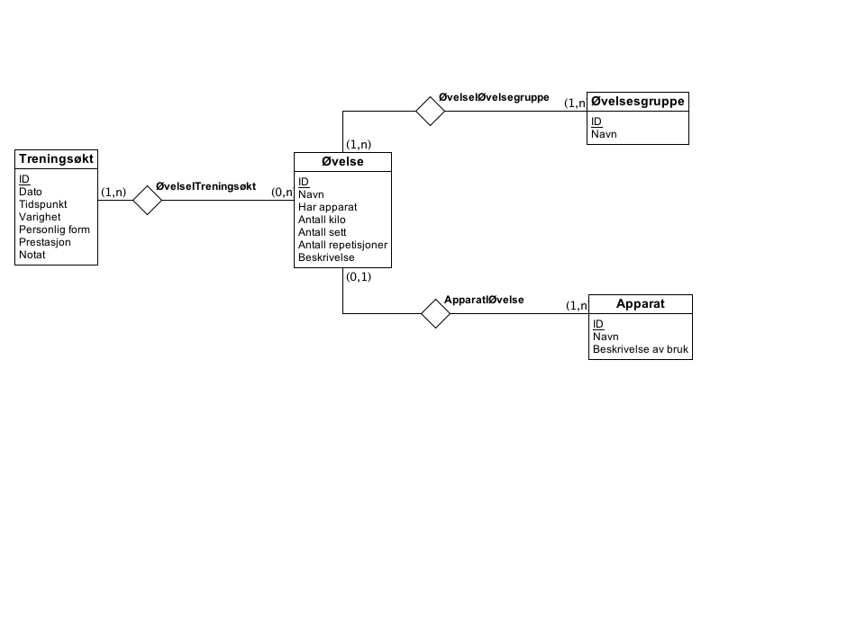

# Beskrivelse av modellen

### ER-diagram av databasen

Oppgave 1c:

For hvert nummerert punkt i kravspesifikasjonen skal det kort forklares hvordan modellen deres oppfyller kravet til en slik funksjonalitet.

### 1. Registrering
Vi har tabeller i SQL som kan registrere apparatoer, øvelser og treningsøkter med tilhørende data.

### 2. Få opp informasjon om n siste treningsøkter
Her kan vi selecte treningsøkter på ID så vi får ut de n siste og kan vise informasjon om dette.

### 3. Resultatlogg av øvelser i tidsintervall
Ved å joine Øvelse og Treningsøkt på gitt dato (og evt. tidspunkt) på dato (og tidspunkt) kan vi får ut øvelsene gjennomført i det gitte tidsrommet. Man kan se ulik prestasjon i antall kilo, sett og reps i relasjonen mellom Treningsøkt og Øvelse.

### 4. Finne øvelser i samme øvelsesgruppe
Vi har testdata lagt inn i databasen som kan brukes til å teste med.

Siden alle øvelser må ha lagt inn hvilke(n) øvelsesgruppe den er i, kan man opprette en øvelsesgruppe og sjekke om øvelsen har den gitte øvelsesgruppa.

### 5. Valgfritt use case
Få informasjon om totalt antall kilo løftet, repetisjoner og sett utført av brukeren.

Gjennom ØvelseITReningsøkt-tabellen har vi tilgang til alle øvelser utført av brukeren
og attributtene Kilo, AntallSett og AntallReps. En summering over radene i de respektive kolonnene vil gi ønske resultat.
